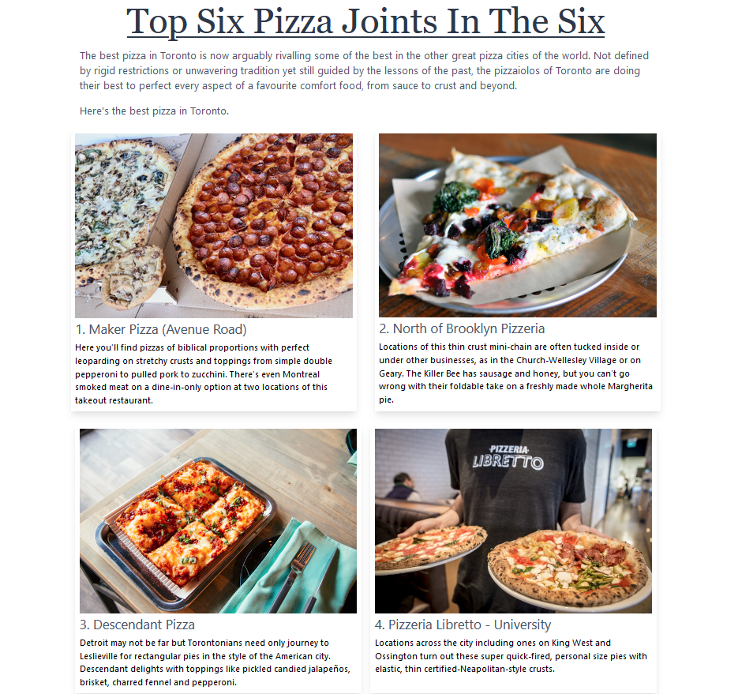
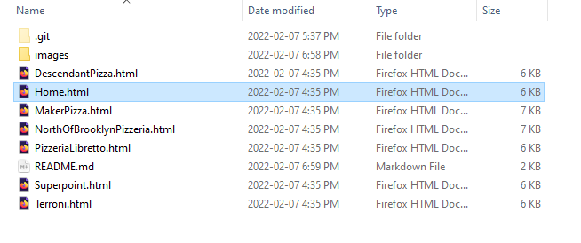
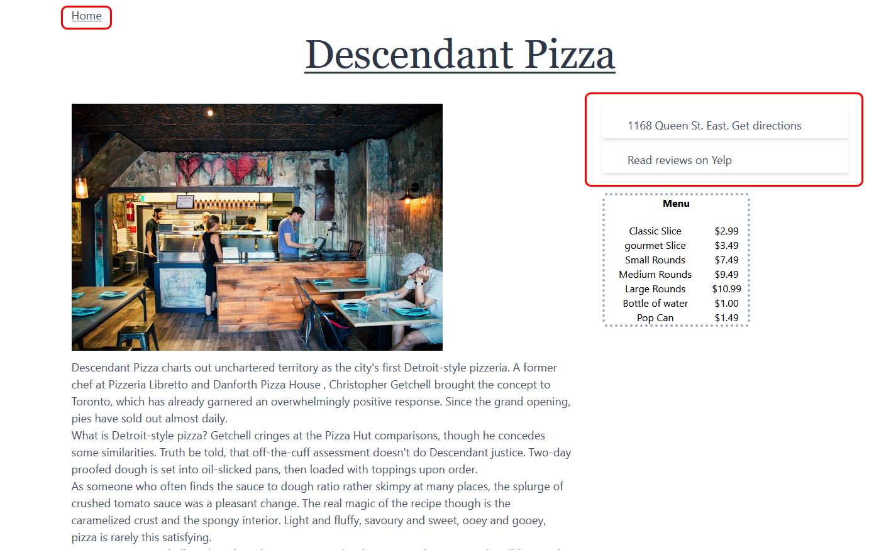

 # Pizza-Blog-Website 
 

 

---

### Table of Contents

- [Description](#description)
- [How To Use](#how-to-use)

---

## Description

This is a website I made in one of my classes in school that discusses the best 
pizza places in Toronto. The home page displays the top six pizza places in the six (Toronto) and 
the user is able to clock any of the six images to read more about it. The home page has 
interactive components that generate feedback to the user. Each image takes the user to one of 
six articles where the pizza place is discussed in detail such as their history, location, menu, adresss, etc.
The user is able to navigate back to the home page and read more articles posted.

#### Technologies

- HTML

[Back To The Top](#pizza-blog-website)

---

## How To Use

#### Installation
1. Download all of the html files and the images folder onto your computer. 
2. Store all downloads into one folder.

#### Navigation
1. Open the html file named "Home.html".

2. Hover on any of the six panels that preview each pizza joints.

3. Click on the panel and it will take you to a seperate page where it will go
into detail about the pizza joint the user has selected. 

4. To view additional information such as customer reviews, click on the feature on the right of the page and it will direct the user to a new page with the information they are looking for.

5. To navigate back to the home page, click on the "Home" button on the top left of the page.

[Back To The Top](#pizza-blog-website)

---

